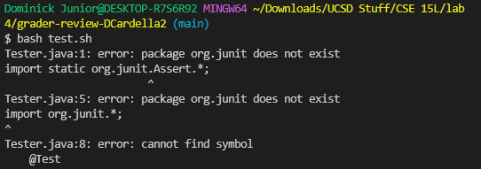
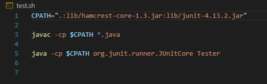
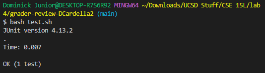
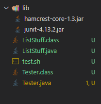

# Lab Report 5 - Putting it All Together

## Part 1 - Debugging Scenario

### Original Student Post

Hi, I was having an issue running a bash script to test my Java program. I am getting an issue saying `package org.junit does not exist`, and I am not sure how to solve this. If I had to guess, it might be something related to my bash script.

Here is a screenshot of my terminal output: 

Here's a screenshot of my bash script: 

### TA's Response

The issue you have implies that the necessary jar files to run junit could not be found. Perhaps there is something wrong with the classpath. If you have a windows computer, there would be a different classpath than a mac. If you are running windows, try using this as the classpath instead: `.;lib/hamcrest-core-1.3.jar;lib/junit-4.13.2.jar`.

### Student Response

I tried running the bash script with the new classpath, and here's the output: 

It seems like the classpath was the issue, since I'm running a Windows computer and the previous classpath was for a Mac. 

### All setup information 

The working directory should have a lib folder with the necessary JUnit jar files, the tester file, the Java program, and the bash script. It should look similar to this: 

The contents of the bash scrript before fixing the bug had the original classpath intended for Mac computers, rather than Windows. 

To trigger the bug, we used the command `bash test.sh`, in order to test our Java program. 

The bug was fixed by changing the classpath to the one intended for Windows computers. 

## Part 2 - Reflection

To me, the most interesting thing I learned was bash scripts. I think it's pretty nice and convenient to put a bunch of terminal commands into one file, which only needs one line to run.

